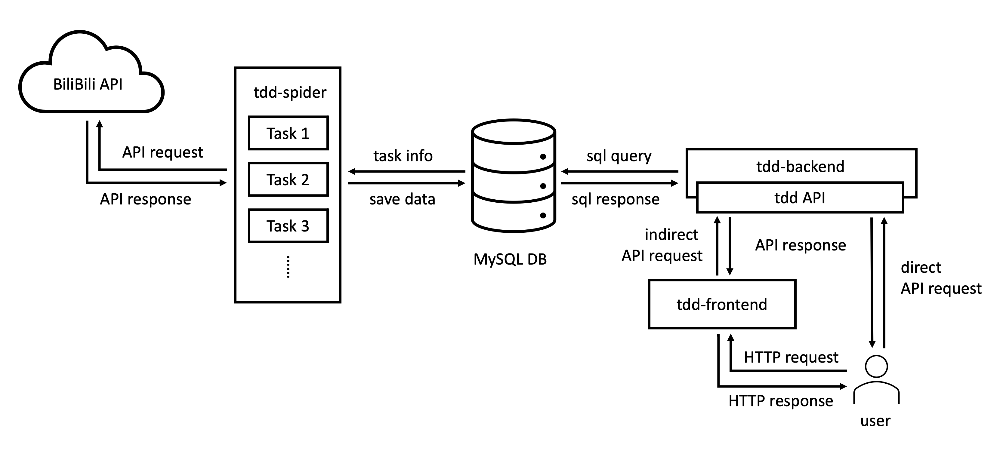

 [English](./README.md) | 简体中文

<h1 align="center">
<b>tdd-spider</b>
</h1>

<div align="center">
天钿Daily（<a href="https://tdd.bunnyxt.com">https://tdd.bunnyxt.com</a>）的数据获取程序，基于Python。QQ群：<a href="https://jq.qq.com/?_wv=1027&k=588s7nw">537793686</a>，欢迎加入！
</div>

## 简介

[天钿 Daily](https://tdd.bunnyxt.com)为 bunnyxt 的个人项目，意在推进 VC 相关数据交流，为任何对 VC 数据感兴趣的用户提供尽可能完备且易得的数据及其可视化展示。

整个项目天然解耦为三个部分，通过中心数据库相连，这三个部分分别是：

- 前端：数据展示与交互（[tdd-frontend](https://github.com/bunnyxt/tdd-frontend)）
- 后端：数据获取接口（[tdd-backend](https://github.com/bunnyxt/tdd-backend)）
- 爬虫：原始数据采集（tdd-spider）

整体结构如图所示



## 安装

1. 下载代码，`git clone https://github.com/bunnyxt/tdd-spider.git && cd tdd-spider`。
2. 配置`Python 3.5+`环境（强烈推荐使用`virtualenv`或`conda`新建虚拟环境以避免依赖冲突），运行`pip install -r requirements.txt`安装依赖。
3. 安装[ProxyPool](https://github.com/Python3WebSpider/ProxyPool)，为了尽可能提高 IP 的可用性，配置以下环境变量
   ```yaml
   CYCLE_TESTER: 10
   CYCLE_GETTER: 60
   TEST_URL: http://api.bilibili.com/x/web-interface/view?aid=456930
   TEST_TIMEOUT: 3
   TEST_BATCH: 100
   ```
   PS：推荐使用`docker`方式使用，并在`docker-compose.yml`文件底部`environment`之后粘贴以上环境变量配置，配置完成后使用`nohup docker-compose up &`在后台启动 ProxyPool 服务。
4. 打开`conf/conf.ini`文件，填写配置，包括数据库连接（`MySQL 5.7.30`）、ProxyPool 地址（默认[http://localhost:5555/random](http://localhost:5555/random)）等。

## 运行

本项目的生产任务由 cron 调度。编号脚本每次启动后完成一轮工作并退出，不需要由仓库内的脚本长期守护。
手工排查时优先使用项目虚拟环境在前台运行，以便保留输出并用 `Ctrl-C` 停止：

```shell
venv-3.11/bin/python <script-name.py>
```

手工启动前，应先确认 cron 或其他操作者没有运行同一个任务。检查进程时先列出 Python 进程，再核对目标 PID 的完整命令：

```shell
ps -eo pid,comm,args --no-headers | awk '$2 ~ /^python/ {print}'
ps -o pid,comm,args --no-headers -p <pid>
```

停止已核实的进程时先发送普通 `SIGTERM`，随后再次检查；不要默认使用 `kill -9`：

```shell
kill -TERM <pid>
ps -o pid,comm,args --no-headers -p <pid>
```

运行状态优先通过下文的 run-record CLI / Web 页面查看；详细诊断再读取 `log/` 中对应的 INFO、WARNING 或单次运行日志。不要把 stdout/stderr 静默丢弃。

部署不由仓库内 helper 执行。目标环境可能无法访问 Git 托管服务；应从一个明确、已审查的 release tree 按该环境的运维流程部署，并在完成后校验完整 runtime 内容，不要假设服务器可以直接 `git pull`。

需要让长任务在 SSH 断开后继续运行时，请遵循目标环境的运维流程，并明确保存输出、核实真实 Python PID 和安排停止/恢复步骤；不要依赖模糊的进程名匹配。

## 查看运行记录

部分脚本会把每次运行写入一条结构化记录（`runrecord/`，SQLite 存于 `data/run-records.sqlite3`）。除命令行查询 `python -m runrecord`（含 `overview` / `trend` 子命令）外，还提供一个**只读** Web 页面用于日常巡检：

- `/` —— 脚本概览：每个脚本一行，显示其最近一次运行的状态、耗时和少量 key metrics，另有健康横幅。
- `/script/<name>` —— 单个脚本的近期运行按 run 对齐成指标时间序列，用简单的 SVG 折线展示（默认 key metrics + 内建 duration，可用复选框表单选择其他指标）。缺失的 run 显示为断点而非 0；折线只表达数值大小，不暗示好坏。
- `/runs` —— 最近运行列表，可按脚本、状态、时间筛选。
- `/run/<id>` —— 单次运行详情：核心字段、按 scope 分组的指标、日志路径。

每个页面同样支持 `?format=json`。

该服务仅监听 `127.0.0.1`，不写数据库、无鉴权。在**存放数据库的机器**上前台启动，再从本地通过 SSH 隧道访问（服务器上 Ctrl-C 结束）：

```shell script
# 在服务器上
python3 -m runrecord.web \
  --host 127.0.0.1 \
  --port 8765 \
  --db data/run-records.sqlite3

# 在本地工作机上
ssh -N -L 8765:127.0.0.1:8765 <服务器>
# 浏览器打开 http://127.0.0.1:8765/
```

也可在工作机上一条命令完成：

```shell script
ssh -t \
  -o ServerAliveInterval=30 \
  -o ServerAliveCountMax=3 \
  -L 8765:127.0.0.1:8765 <服务器> \
  'cd <项目目录> && exec python3 -m runrecord.web --host 127.0.0.1 --port 8765 --db data/run-records.sqlite3'
```

PTY 使前台 Web 进程跟随 SSH session 的生命周期，keepalive 则会及时发现已经失效的连接。

## 脚本列表

本系统内置了一些定时数据获取或处理脚本，位于根目录下，文件名满足`数字+下划线+由短横线连接的一组英文单词+.py`格式，例如`16_daily-update-member-info.py`。这里对这些内置的脚本做一个简单的介绍。

首先解释一下文件名的含义：

- 下划线前的数字为`脚本编号`，通常功能相似的脚本使用相近的编号前缀。
- 下划线后的由`-`连接的一组英文单词为该脚本的功能介绍，供使用者快速了解脚本含义，节约文档查询时间。

// TODO

## 自定义脚本

内置脚本仅满足当前系统运行需要。当然，用户也可以自定义脚本，以满足未来的或者临时的需求。

注意：为了方便使用`run_xxx.sh`系列工具管理，建议仿照上文提到的内置脚本的命名规范，给自定义脚本命名。

// TODO 实质就是调用模块，给一个直接调用的例子，一个定时任务的例子，一个 jupyter notebook 的例子

## 模块文档

### common

### conf

### db

### pybiliapi

### spider

### util

// TODO

## 声明

本项目提供了一种全自动定时数据获取系统的构建思路与实现，供学习交流。由于本人能力有限，系统构建难免存在各种大小问题，请勿直接在生产环境使用，如有损失恕不负责。

**特别提醒**：请遵守各地法律法规，切勿使用本系统通过非法手段采集任何敏感信息，或进行任何非法活动，一切后果请自行承担。

如果你对我或者我的项目感兴趣，欢迎通过以下方式联系我：

- 新浪微博 [@牛奶源 29](https://www.weibo.com/nny29)
- Twitter [@bunnyxt29](https://twitter.com/bunnyxt29)
- Email <a href="mailto:bunnyxt@outlook.com">bunnyxt@outlook.com</a>

by. bunnyxt 2021-01-14
